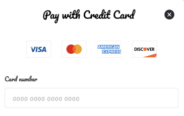
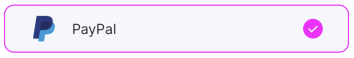
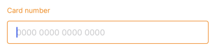

# Appearance

YunoSDK allows the modification of the appearance of some of its components, allowing you to specify the font and some colors.

In the initialization of the library you can optionally pass the appearance parameter with the following initialization:

```swift
public init(
    fontFamily: String?,
    accentColor: UIColor,
    buttonBackgroundColor: UIColor,
    buttonTitleColor: UIColor,
    buttonBorderColor: UIColor,
    secondaryButtonBackgroundColor: UIColor,
    secondaryButtonTitleColor: UIColor,
    secondaryButtonBorderColor: UIColor,
    disableButtonBackgroundColor: UIColor,
    disableButtonTitleColor: UIColor
)
```
Some of the attributes that can be modified are specified in the following table:

| Attribute | Description |
| ----- | ----- |
| fontFamily | Name of the font for all SDK components |
| accentColor | Primary color for selected elements, loaders, status screens, etc. |
| buttonBackgroundColor | Background color for primary buttons |
| buttonTitleColor | Text color for primary buttons |
| buttonBorderColor | Border color for primary buttons |
| secondaryButtonBackgroundColor | Background color for secondary buttons |
| secondaryButtonTitleColor | Text color for secondary buttons |
| secondaryButtonBorderColor | Border color for secondary buttons |
| disableButtonBackgroundColor | Background color for disabled buttons |
| disableButtonTitleColor | Text color for disabled buttons |

### Font Family

The name of any font that is supported in your application and has support for regular and bold settings. All components within the library that have text will be displayed with the font indicated at library initialization.

```swift 
Yuno.Appearance(fontFamily: "Pacifico")
```



### Accent Color

The accent color is the color of selected elements within the library, such as text fields, payment methods, progress bars, among others.

Some examples for the accent color:

| Code | Capture |
| ---- | ------- |
| `Yuno.Appearance(accentColor: .cyan)` |  |
| `Yuno.Appearance(accentColor: .magenta)` |  |
| `Yuno.Appearance(accentColor: .cyan)` |  |
| `Yuno.Appearance(accentColor: .orange)` |  |

### Button config

The primary and secondary buttons can be customized as in the following example:

```swift
Yuno.Appearance(
    buttonBackgroundColor: .black,
    buttonTitleColor: .yellow,
    buttonBorderColor: .yellow,
    secondaryButtonBackgroundColor: .white,
    secondaryButtonTitleColor: .red,
    secondaryButtonBorderColor: .red,
    disableButtonBackgroundColor: .darkGray,
    disableButtonTitleColor: .lightGray
)
```
The result is shown in the following image:


